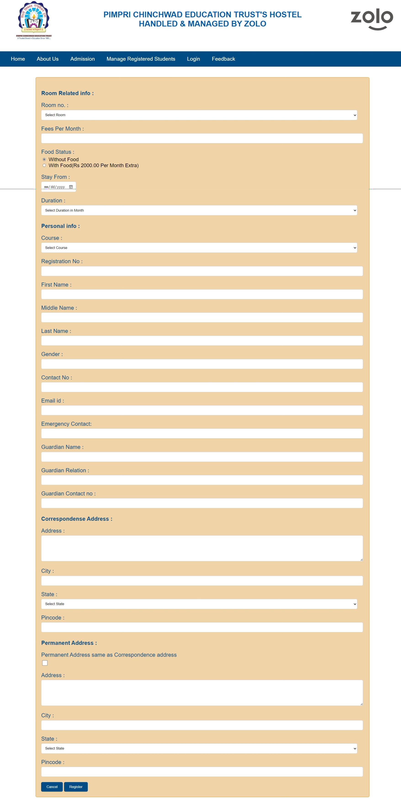
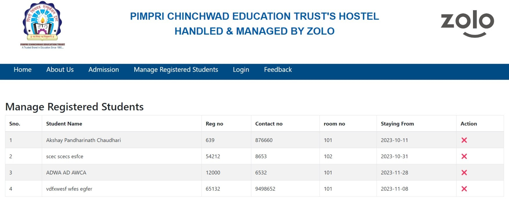
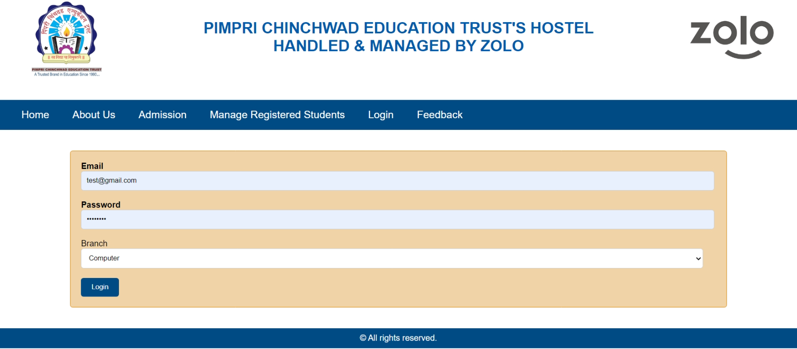
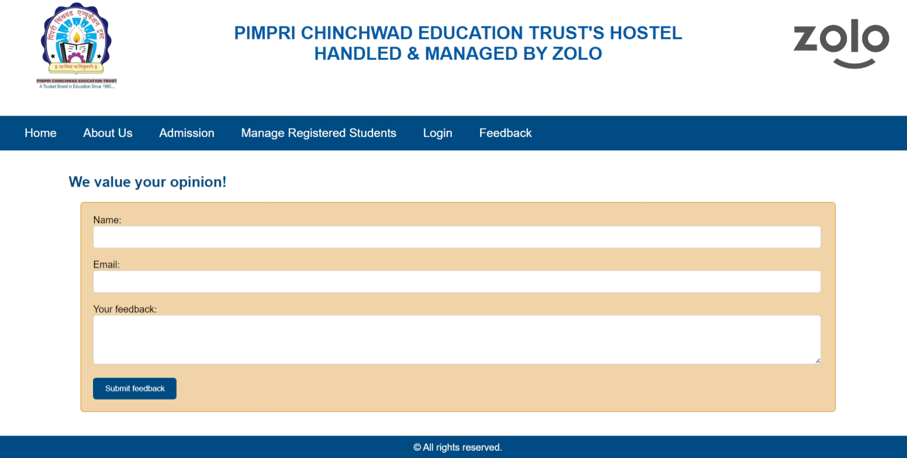

# Hostel Management Website

## Overview

The Hostel Management website serves as a comprehensive platform for accessing essential information related to the hostel, including details about accommodations, fee structures, available facilities, and contact information. The primary objective is to provide a user-friendly interface for students to apply for hostel admission by submitting online forms, with all applicant details securely stored in the backend.

## Features

- **Accommodation Details:** View information about the types of accommodations available.
- **Fee Structures:** Check the fee structures for different accommodations.
- **Facilities:** Explore the various facilities provided by the hostel.
- **Contact Information:** Access contact details for hostel management.
- **Online Application:** Apply for hostel admission through online forms.
- **Feedback Submission:** Provide feedback to help improve hostel services.

## Technology Stack

- **Front-end:** HTML, CSS, JavaScript, Bootstrap
- **Back-end:** PHP, MySQL
- **Hosting:** XAMPP Server

## Objectives

- **User-Friendly Interface:** Designed to provide a seamless experience for students applying for hostel admission.
- **Secure Data Storage:** Applicant details are securely stored in the backend, ensuring privacy and data protection.
- **Efficient Management:** Enables hostel faculty to efficiently manage student information for administrative tasks.
- **Quality Improvement:** Facilitates student feedback, contributing to ongoing quality improvements in hostel services.
- **Streamlined Processes:** Simplifies the admission process and enhances overall service quality through valuable user input.

## Screenshots

Here are some screenshots of the project:

1. 
2. 
3. 
4. 
5. 
